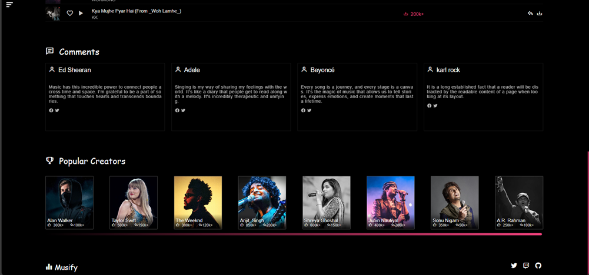
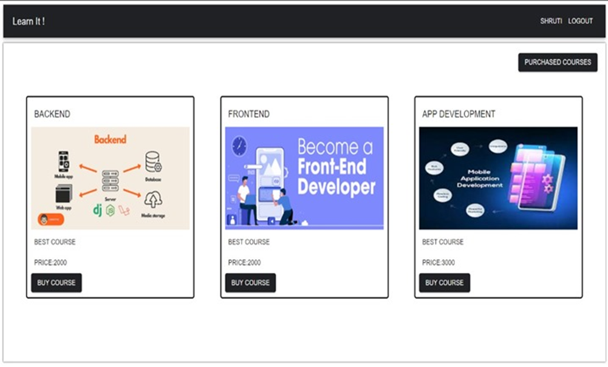

SummerIntership2024_22IT045

4th Sem Summer Internship

#🌟 Code Alpha Technology Summer Internship 2024 - Project Showcase 🌟

Welcome to my GitHub repository for the Code Alpha Technology Summer Internship 2024! This project showcases the work done during the internship, including practical insights and hands-on experience with Code Alpha Technology.

Start of Internship

week 1 In the first week I learnt basic of html, css, javascript, react and after it’s completed I move in advance of it.

For the next week I move to make a basic project. For my first project I use html, css, javascript

week 2 In the second week I make one project name is Image Gallery. This project was made using html,css and javascript.

For the next week I move to make a Music Website. For my second project I will use html,css,javascript.

week 3 In the third week I make one project name is Music Website. This project was made using html,css,javascript.

For the next week I move to make a Course Selling Website For my third project I will use mern stack technology .

week 4 In the last week of my internship I made one Course Selling Website. It’s Built using modern technologies like html,css,javascript for the frontend. This application for selling course,adding course,editing course

